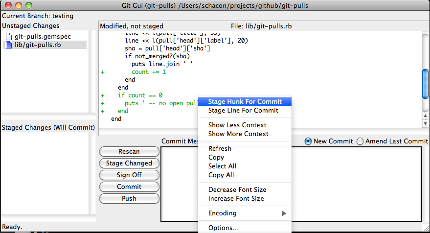
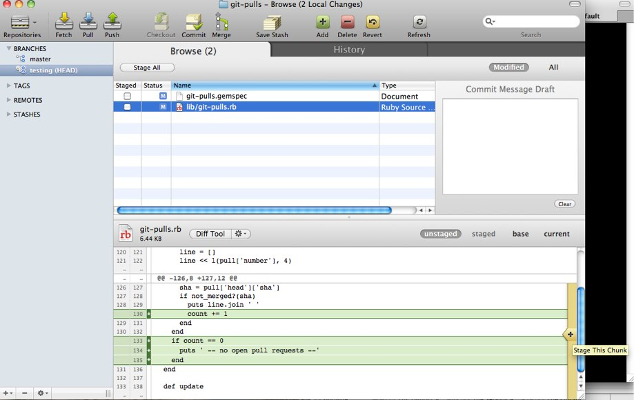

!SLIDE center subsection

# Scott Chacon's Guide to Making Proper Commits #

!SLIDE
# Check them for whitespace #

!SLIDE code

# git diff --check #

!SLIDE smaller

<pre>
$ git diff --check
lib/simplegit.rb:5: trailing whitespace.
+    @git_dir = File.expand_path(git_dir)XX
lib/simplegit.rb:7: trailing whitespace.
+ XXXXXXXXXXX
lib/simplegit.rb:26: trailing whitespace.
+    def command(git_cmd)XXXX
</pre>

!SLIDE
# Logically Separate Changeset #

!SLIDE code

# git add --patch #

!SLIDE center

# git-gui #

!SLIDE center

# Git Tower #

!SLIDE
# Helpful commit message #

!SLIDE smaller

    Short (50 chars or less) summary of changes

    More detailed explanatory text, if necessary.  Wrap it to
    about 72 characters or so.  In some contexts, the first line
    is treated as the subject of an email and the rest of the
    text as the body.  The blank line separating the summary from
    the body is critical (unless you omit the body entirely); 
    tools like rebase can get confused if you run the two together.

    Further paragraphs come after blank lines.

     - Bullet points are okay, too

     - Typically a hyphen or asterisk is used for the bullet, 
       preceded by a single space, with blank lines in between, 
       but conventions vary here

!SLIDE commit

    commit 71a5d4bc0e4025b3fbdeed76052b39fcef284e8c
    Author: Jonathan Nieder <jrnieder@gmail.com>
    Date:   Sun Dec 26 03:07:31 2010 -0600

      diff: funcname and word patterns for perl

      The default function name discovery already works quite well for Perl
      code... with the exception of here-documents (or rather their ending).

       sub foo {
          print <<END
       here-document
       END
          return 1;
       }

      The default funcname pattern treats the unindented END line as a
      function declaration and puts it in the @@ line of diff and "grep
      --show-function" output.

      With a little knowledge of perl syntax, we can do better.  You can
      try it out by adding "*.perl diff=perl" to the gitattributes file.

!SLIDE
# One Branch or Series per Topic #

!SLIDE bullets incremental

# Scott Chacon's Guide to Making Proper Commits Overview #

* Check for whitespace
* Logically Separate Changesets (LSC)
* Helpful commit messages
* One branch/series per topic
