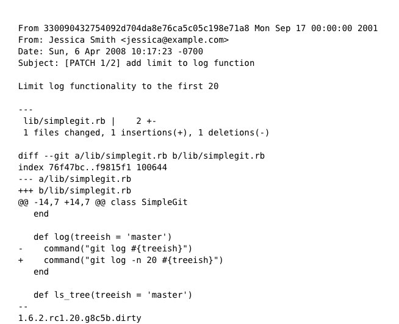
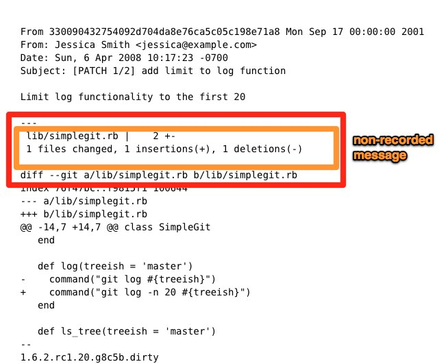
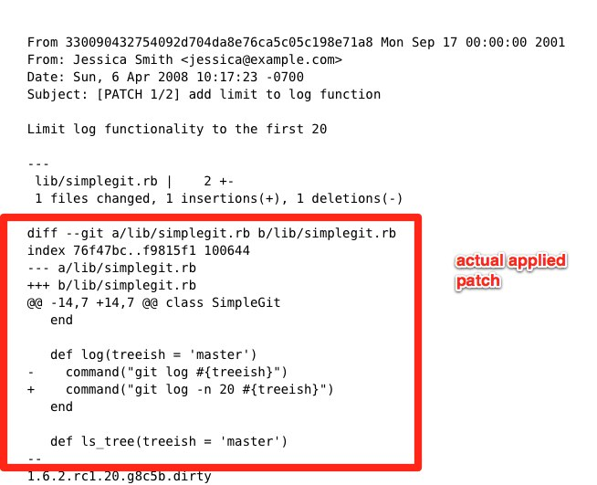
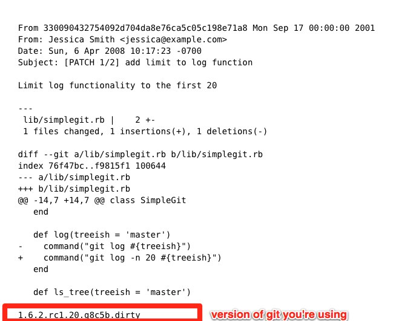

!SLIDE center subsection
# Mailing Lists #

!SLIDE bullets incremental

# Mailing List Contributor Workflow #

* one clean branch per series
* extract to patch files
* mail to mailing list

!SLIDE

# 1. Series on a clean branch #

!SLIDE code
  
# git rebase origin/master #

!SLIDE

# 2. Extract your branch to mbox patch files #

!SLIDE commandline incremental

    $ git checkout my-topic-branch

    $ git format-patch -M origin/master
    0001-add-limit-to-log-function.patch
    0002-changed-log-output-to-30-from-25.patch

    
!SLIDE center code
## 0001-add-limit-to-log-function.patch ##

!SLIDE center code
## 0001-add-limit-to-log-function.patch ##

!SLIDE center code
## 0001-add-limit-to-log-function.patch ##

!SLIDE center code
## 0001-add-limit-to-log-function.patch ##

!SLIDE center code
## 0001-add-limit-to-log-function.patch ##

!SLIDE

# 3. Mail series to the mailing list #

!SLIDE

# ~/.gitconfig #

    [imap]
      folder = "[Gmail]/Drafts"
      host = imaps://imap.gmail.com
      user = user@gmail.com
      port = 993
      sslverify = false

!SLIDE commandline incremental

    $ git send-email *.patch
    0001-added-limit-to-log-function.patch
    0002-changed-log-output-to-30-from-25.patch
    Who should the emails appear to be from? [Jessica Smith <jessica@example.com>] 
    Emails will be sent from: Jessica Smith <jessica@example.com>
    Who should the emails be sent to? jessica@example.com
    Message-ID to be used as In-Reply-To for the first email? y

!SLIDE bullets

# Mailing List Contributor Workflow #

* one clean branch per series
* extract to patch files
* mail to mailing list

