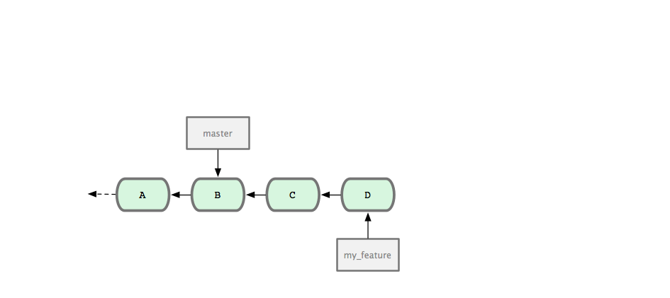
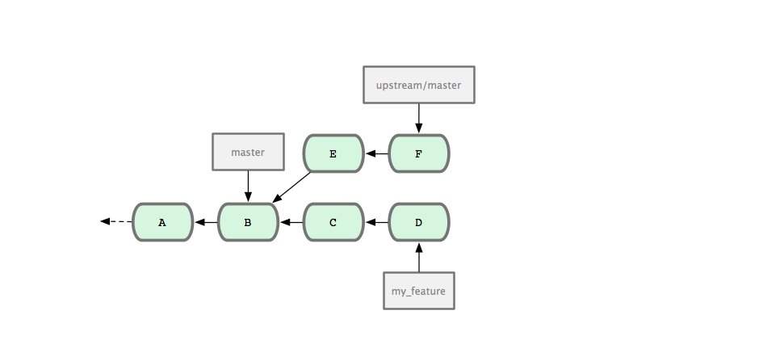
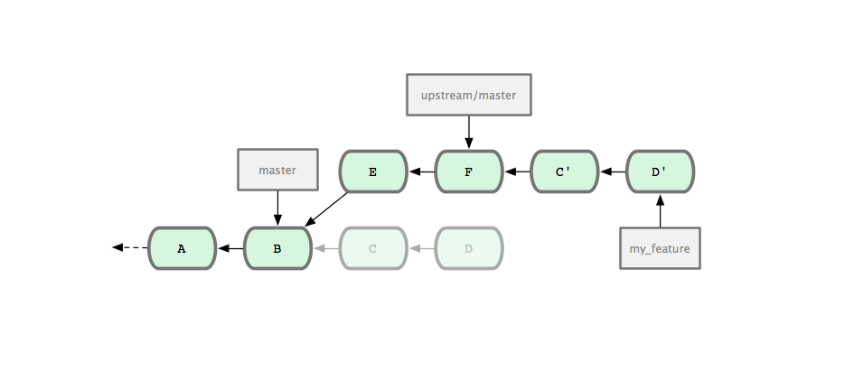

!SLIDE section
# Requesting a Pull #

!SLIDE bullets incremental
# Requesting a Pull #
* make your branch up to date
* push to a named branch
* contact the author

!SLIDE commandline incremental

    $ git remote add upstream git://github.com/fabpot/symfony.git
    $ git fetch upstream
    remote: Counting objects: 958, done.
    remote: Compressing objects: 100% (335/335), done.
    remote: Total 758 (delta 402), reused 650 (delta 320)
    Receiving objects: 100% (758/758), 144.80 KiB, done.
    Resolving deltas: 100% (402/402), completed with 138 local objects.
    From git://github.com/fabpot/symfony
     * [new branch]      master     -> upstream/master

    $ git rebase upstream/master
    First, rewinding head to replay your work on top of it...
    Applying: add contributing link to readme
    Applying: updated licence file

    $ git push origin my_feature
    Counting objects: 9, done.
    Delta compression using up to 2 threads.
    Compressing objects: 100% (6/6), done.
    Writing objects: 100% (6/6), 675 bytes, done.
    Total 6 (delta 4), reused 0 (delta 0)
    To git@github.com:schacon/symfony.git
     * [new branch]      my_feature -> my_feature

!SLIDE

# git checkout -b my_feature #

!SLIDE

# commit; commit #

!SLIDE

# git fetch upstream #

!SLIDE

# git rebase upstream/master #

!SLIDE

# Contact the Maintainer #

!SLIDE code

# git request-pull #
     
!SLIDE commandline incremental

    $ git request-pull upstream/master origin
    The following changes since commit 97679e5bdab5f2494d6f444d995ae79dd4ccb3ca:

     [DoctrineAbstractBundle] added test for new Loader (2011-02-08 04:11:47 +0100)

    are available in the git repository at:
     git@github.com:schacon/symfony.git my_feature

    Scott Chacon (2):
         add contributing link to readme
         updated licence file

    LICENSE |    2 +-
    README  |    5 +++++
    2 files changed, 6 insertions(+), 1 deletions(-)
    
